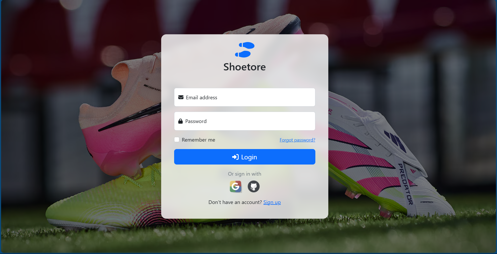
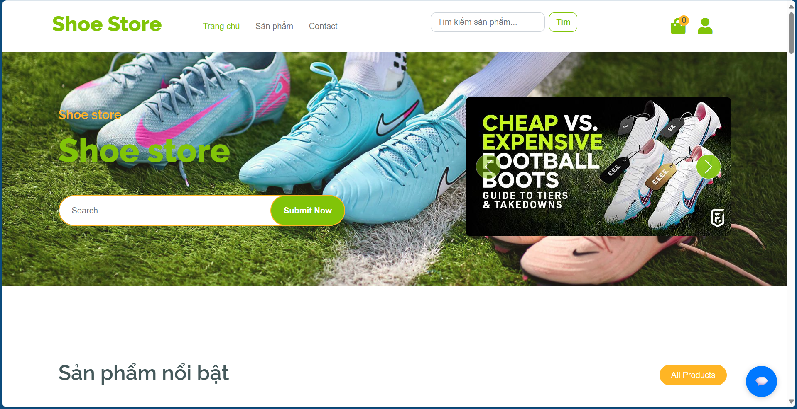
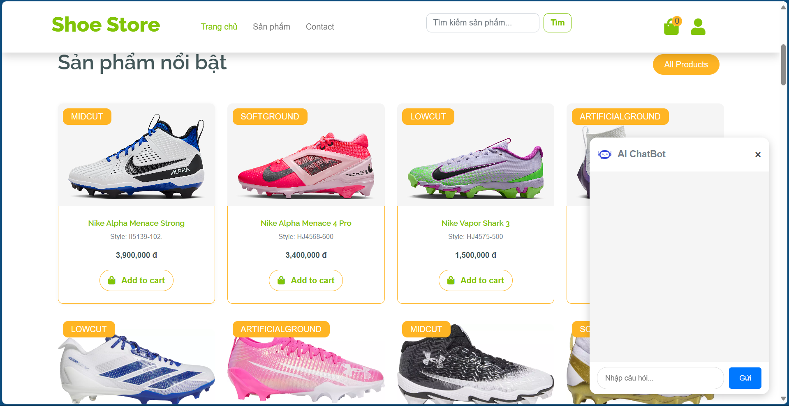
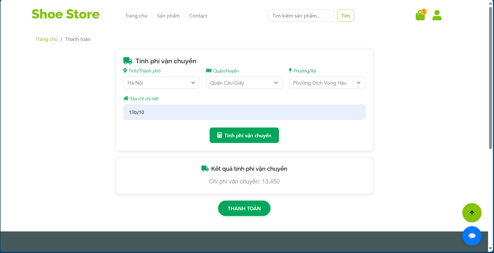
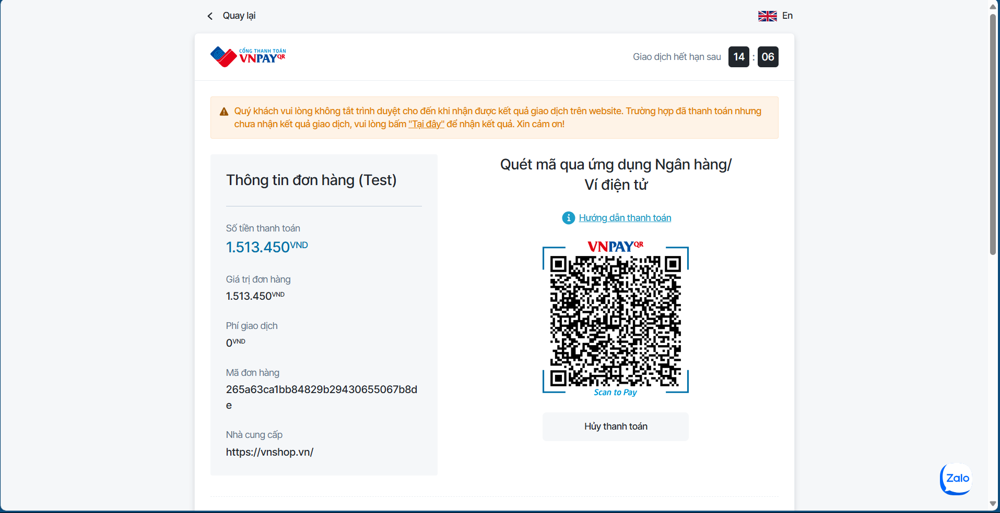
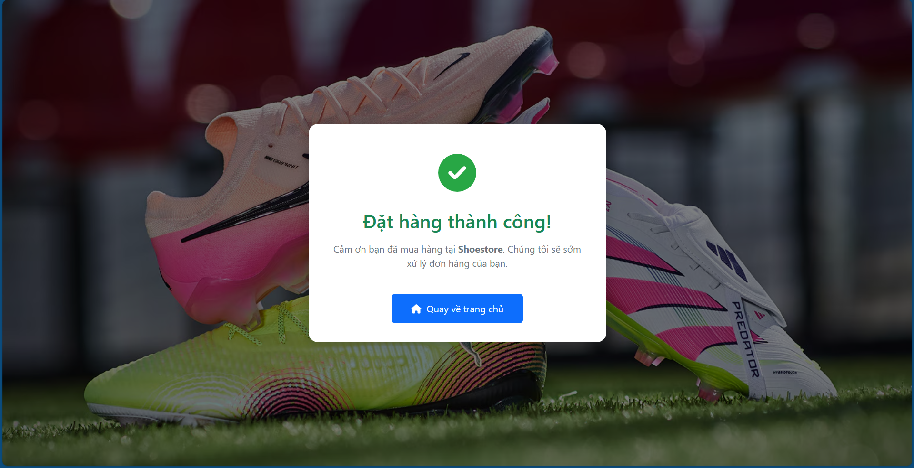
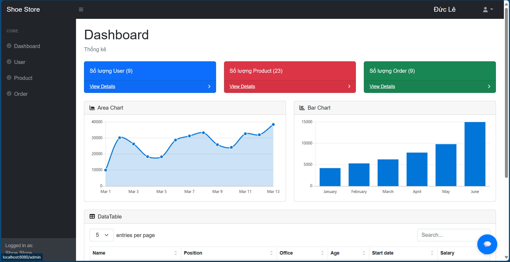

# 🏬 Shoe Store - Spring Boot Web Application

## 1. Giới thiệu

**Shoe Store** là một ứng dụng web bán hàng về giày bóng đá trực tuyến được xây dựng bằng Spring Boot. Dự án hỗ trợ đầy đủ chức năng cho người dùng và quản trị viên, thanh toán trực tuyến, tích hợp chatbot AI, và giao hàng nhanh.

---

## 2. Cấu trúc dự án

<pre>
SHOE-STORE/
├── mysql-init/                   # File SQL khởi tạo CSDL
├── src/
│   ├── main/
│   │   ├── java/com/example/food_store/
│   │   │   ├── config/           # Cấu hình Spring Security & Web
│   │   │   ├── controller/       # Controller cho admin & client
│   │   │   ├── domain/           # Entity & DTO
│   │   │   ├── repository/       # Repository JPA
│   │   │   └── service/          # Business logic
│   ├── resources/                # application.properties
│   └── webapp/                   # View JSP,JSTL tài nguyên tĩnh (JS/CSS/IMG)
├── pom.xml                       # Cấu hình Maven
</pre>

---

## 3. Chức năng chính

### 👤 Người dùng
- Đăng ký, đăng nhập, quên mật khẩu
- Cập nhật thông tin cá nhân, đổi mật khẩu
- Xem sản phẩm, chi tiết sản phẩm
- Thêm sản phẩm vào giỏ hàng
- Đặt hàng và theo dõi lịch sử mua hàng

### 🛠️ Quản trị viên
- Quản lý sản phẩm (thêm, sửa, xóa)
- Quản lý đơn hàng
- Quản lý người dùng
- Xem dashboard thống kê

---

## 4. Tính năng khác

- 🤖 **Chatbot AI Gemini**: Tư vấn và hỗ trợ khách hàng
- 💳 **Thanh toán VNPAY**: Hỗ trợ thanh toán online
- 🔐 **OAuth2 Login**: Đăng nhập bằng Google và GitHub
- 🚚 **Giao Hàng Nhanh API**: Tính phí vận chuyển theo địa chỉ thực tế

---

## 5. Hướng dẫn chạy dự án

###  Dùng Maven & MySQL cài đặt sẵn
Cấu hình database trong application.properties
Chạy lệnh:
```bash
./mvnw spring-boot:run
```

### Kết quả sau khi chạy thành công: 

 <br></br>

  <br></br>

  <br></br>

 <br></br>

 <br></br>
 

<br></br>


---

## 6. Công nghệ sử dụng
- Spring Boot 
- Spring Security (Form Login & OAuth2 Login)
- Spring MVC
- Spring Session
- Spring Data
- Spring Framework
- JSP, JSTL View Engine
- MySQL
- Maven
- Elastic Search

 
### Yêu cầu về version

- **Java:** version `17+`
- **Maven:**  `3.6+`
- **MySQL Server:** version `8.0+`


